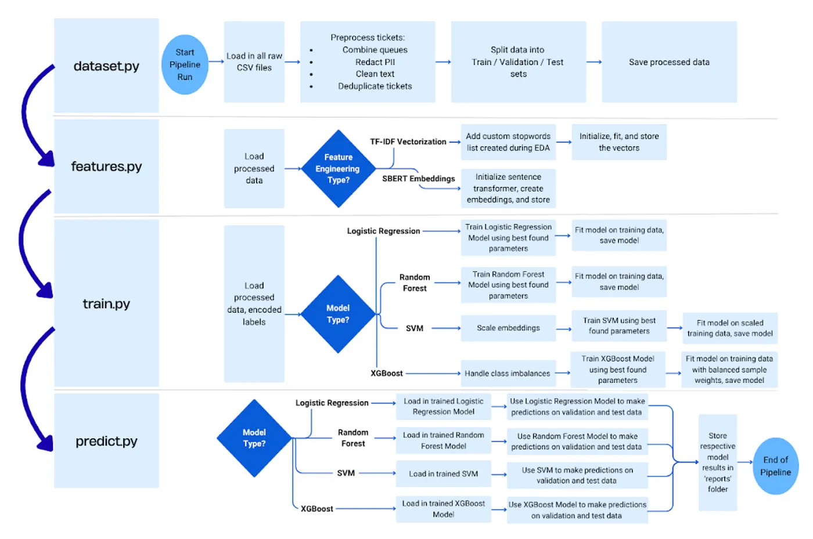

# Support Ticket Automated Routing Assistant (SARA): Automated Queue Classification for Customer Support Tickets

## Problem, Impact, and Motivation
Organizations selling digital products or services often process thousands of customer-support tickets daily. Each incoming message needs to be classified and routed to the best-fitting queue, whether it be Billing, Technical Support, Returns, General Inquiry, or another specialized team. 

This project aims to reduce ticket misrouting by using machine learning models to predict the correct queue based on its text content. I'm motivated by the opportunity to improve mean time-to-resolution, reduce inefficient use of company resources, decrease the amount of unnecessary ticket reassignments, and provide scalabilitiy in customer support operations.

## What can SARA do?
  - Accepts user complaints via GUI.
  - Predicts the top 3 most likely queues with confidence scores
  - Explanations prediction by highlighting which words influenced the model
  - Agents can confirm or override the queue assignment
## Example


## Installation

  1. Clone the repository:

```bash
git clone https://github.com/<your-username>/sara-2.0.git
cd sara-2.0
```

  2. pip install -r requirements.txt
  3. streamlit run app.py


## Project Structure
sara-2.0/
│
├── app.py                 # Streamlit app entrypoint
├── src/
│   ├── preprocess.py      # Text cleaning, PII redaction, embeddings
│   ├── predict.py         # Model prediction logic
│   ├── interpret.py       # LIME-based explanation
│
├── models/                # Trained model, encoder, and scaler files
├── tests/                 # Unit tests
├── requirements.txt       # Dependencies
└── README.md              # Project documentation


## Data Source
The model was trained on a dataset of support tickets containing, but not limited to these vital features: 
   - Ticket Subject: Text description of the ticket subject
   - Ticket Body: Text description of the ticket issue.
   - Queue Label: The historically assigned queue for ticket resolution.

The dataset can also found at the following link: [Customer Support Ticket Data](https://www.kaggle.com/datasets/tobiasbueck/multilingual-customer-support-tickets/data). This data falls under the CC BY 4.0 license.

## Model Development Methodology
 
1. Data Loading + Preprocessing
    - Map similar queues to broader catergories (e.g Technical Support + IT Support → Technical & IT Support)
    - Redact personally identifiable information (PII).
    - Clean and normalize text fields.
    - Deduplicate and split into train, validation, and test set while following    procudures to prevent data leakage.
2. Feature Engineering
    - TF-IDF Vectorization
    - SBERT Sentence Embeddings
3. Model Training
    - Logistic Regression (with TF-IDF)
    - Random Forest (with SBERT)
    - Support Vector Classifier (with SBERT)
    - eXtreme Gradient Boosting (with SBERT)
4. Evaluation
    - Generate classification reports for each model

## Model Report and Findings
[SARA Report](https://toobrightideas.medium.com/querious-detector-using-ai-to-assist-with-support-queue-ticket-assignment-98c4dbc08e21)

